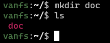

# Vanfs

## What is vanfs?

**Vanfs (vandi's virtual file system)** is a virtual file system.

> [!CAUTION]
>
> IT ISN'T A VIRTUAL OS!!!

Vanfs isn't supposed to be a real file system, it only looks like a file system.

## How to install it?

### Windows

To install vanfs on [windows](https://ru.wikipedia.org/wiki/Windows) you need to follow this steps

1. Prepare

    [install go](https://go.dev/dl/) if you don't have it.

2. Install

    ```powershell
    go install github.com/vandi37/vanfs
    ```
3. Enjoy your vanfs
    
    ```powershell
    vanfs
    ```

### Linux and MacOS

To install vanfs on [linux](https://ru.wikipedia.org/wiki/Linux) or [macos](https://ru.wikipedia.org/wiki/MacOS) you need to follow this steps

1. Prepare

    [install go](https://go.dev/dl/) if you don't have it.
    [install git](https://git-scm.com/downloads) if you don't have it.

    optional

    you can install [Make](https://ru.wikipedia.org/wiki/Make) if you want to use [Makefile](Makefile)

2. Clone the repository.

    ```bash
    git clone git@github.com:vandi37/vanfs.git
    cd vanfs
    ```

3. Install.

    You have two variants 

    1. Use [Makefile](Makefile)

        ```bash
        make install # you can edit the bin path in the Makefile
        ```

        > [!WARNING]
        >
        > **Be sure that you are at the root of the project.**

    2. Install by yourself

        ```bash
        sudo rm -rf /usr/bin/vanfs # or your bin path
        go build 
        sudo mv vanfs /usr/bin  # or your bin path
        ```

        > [!WARNING]
        >
        > **Be sure that you are at the root of the project.**

4. Enjoy your vanfs
    
    ```bash
    vanfs
    ```

## How to create a new vfs?

If you run the program you will see the start menu


- to choose a variant use arrows **up** and **down**

- to exit use **ctrl+c**

### What means "Load from path"?

To storage the directory tree and all file data should be a directory (in the real filesystem) with all files and the [file with tree](example\tree.json)

### Creating new file system


You can enter any name.


Default name will be **vfs**


After you need to enter path to backup directory 

The directory should exist, or the program will trow an error


Default will be ***current path*/vfs_backup/**

Congratulations! You have created your vanfs


### Loading from path


Enter path to backup directory


Congratulations! You have loaded your vanfs


### Loading from default path

It loads from env. 

to set path you need on linux you can do this

```bash
export VFS_PATH="/home/your_username/vfs_data"
```

The directory should exist, or the program will trow an error

After running vanfs and choosing **"Load from default path"** the vfs will load


## How to use?

After creating and loading your vfs you can run this commands

### Working with directories

Commands :
    - `cd` (change directory)
    - `mkdir` (make directory)
    - `rmdir` (remove directory)

- cd {path} 

    move your current directory to another directory

- cd / 

    moves you to the root

    

- cd ..

    moves a directory higher in the directory tree

    

> [!TIP]
> 
> you can use 
> ```vanfs
> cd ../..
> ``` 
>
> going two directories higher
>
> ```vanfs
> cd ../../..
> ```
>
> going three directories higher
>
> ```vanfs
> cd /home
> ```
> going to home directory

- mkdir {name} 

    creates a directory with *name*

    

    > [!TIP]
    > 
    > **ls** shows the list of directories and files

- mkdir {path for cd}/{name} 

    creates a directory as the command was

    ```vanfs
    cd {path for cd}
    mkdir {name} 
    ```

    however cd can't move to not existing directory, and here it will create all directories that not exist.

    

    

    

- rmdir {name}

    removes a directory with *name* 

    

- mkdir {path for cd}/{name} 

    as 
    
    ```vanfs
    mkdir {path for cd}/{name} 
    ```

    it is as 

    ```vanfs
    cd {path for cd}
    rmdir {name} 
    ```

    and here if any directory in cd command or in rmdir does not exist it sends an error

    

    

    

 ### Working with files

Commands :
    - `of` (open file)
    - `cat` (catenate)
    - `mkf` (make file)
    - `rm` (remove file)

- of {name}

    opens a file i text editor based on [text area](https://github.com/charmbracelet/bubbles/tree/v0.20.0?tab=readme-ov-file#text-area)

    

    

    you can write any text

    

    to save `ctrl+s`

    

    to exit `ctrl+c`

    > [!TIP]
    >
    > for all {name} it is the same as with mkdir with entering any path.

- cat {name}

    prints all file data

    

- mkf {name} 

    creates a new file

    

- rm {name} 

    removes the file

    

### Lists 

Commands :
    - `ls` (list)
    - `tree`

- ls {path (could be empty)}

    shows list of all directories and files

    

    

- tree {path (could be empty)}

    shows the tree 

    

    

### Other 

Commands:

  - `clear` (clears console)
  - `exit` (exits from vfs)
  - `path` (shows path to backup file)

- clear

    clears console 

    

    

- exit

    exits from vfs

    

- path

    shows path to backup file

    